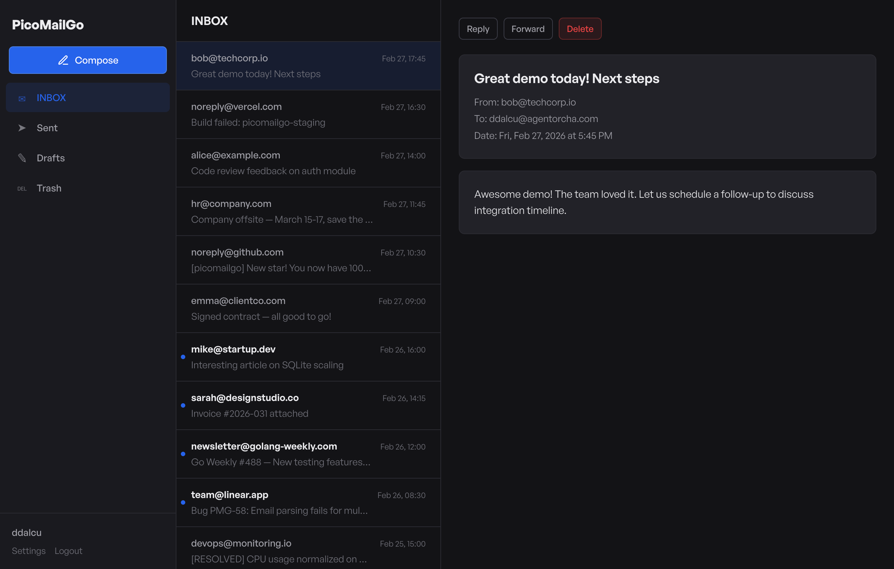

# PicoMailGo

A full-featured email server that fits in a **6 MB Docker image** and idles at **~9 MB of RAM**. One binary. No dependencies. No Postfix, no Dovecot, no MySQL, no Redis.

SMTP in, SMTP out, IMAP, webmail, DKIM signing, delivery queue — everything you need to send and receive email, backed by a single SQLite file.

Perfect for **homelabs**, **developer testing**, **self-hosted projects**, and **AI agents** that need to send or receive email without spinning up an entire mail stack.

## Features

- **Inbound SMTP** — receive mail from the internet (port 25)
- **SMTP Submission** — send mail from email clients (port 587, AUTH PLAIN)
- **IMAP** — read mail from any IMAP client (port 993)
- **Webmail** — dark-themed web UI with compose, reply, forward, attachments
- **DKIM** — automatic key generation and message signing
- **TLS** — none, Let's Encrypt autocert, or manual certificate
- **SQLite** — single-file database, zero external dependencies
- **Queue** — outbound delivery with exponential backoff retries
- **Docker** — single `scratch`-based image, **6 MB**

## Screenshot



## Quick Start with Docker Compose

```yaml
# docker-compose.yml
services:
  picomailgo:
    image: ghcr.io/ddalcu/picomailgo:latest
    ports:
      - "2525:2525"
      - "8080:8080"
      - "5587:5587"
      - "9993:9993"
    volumes:
      - mail-data:/data
    environment:
      MAIL_DOMAIN: localhost
      DATA_DIR: /data
      JWT_SECRET: "replace-with-a-random-secret"
    restart: unless-stopped

volumes:
  mail-data:
```

```bash
docker compose up -d
```

Open [http://localhost:8080](http://localhost:8080) to access webmail.

## Quick Start with Docker

```bash
docker run \
  -p 2525:2525 -p 8080:8080 -p 5587:5587 -p 9993:9993 \
  -v mail-data:/data \
  -e MAIL_DOMAIN=localhost \
  -e JWT_SECRET=replace-with-a-random-secret \
  -e DATA_DIR=/data \
  ghcr.io/ddalcu/picomailgo:latest
```

## Environment Variables

| Variable | Default | Description |
|----------|---------|-------------|
| `MAIL_DOMAIN` | `localhost` | Domain name for the mail server |
| `JWT_SECRET` | `change-me` | Secret key for JWT auth tokens |
| `DATA_DIR` | `./data` | Directory for SQLite DB and DKIM keys |
| `WEB_LISTEN` | `:8080` | Web UI listen address |
| `HTTP_LISTEN` | `:80` | HTTP listen address (for autocert) |
| `SMTP_INBOUND_LISTEN` | `:2525` | SMTP inbound listen address |
| `SMTP_SUBMISSION_LISTEN` | `:5587` | SMTP submission listen address |
| `IMAP_LISTEN` | `:9993` | IMAP listen address |
| `TLS_MODE` | `none` | TLS mode: `none`, `autocert`, or `manual` |
| `TLS_CERT_FILE` | | Path to TLS certificate (manual mode) |
| `TLS_KEY_FILE` | | Path to TLS private key (manual mode) |

## DNS Setup

For your domain (e.g. `example.com`) with mail server at `mail.example.com`:

```
; MX record — tells the world where to deliver mail for @example.com
example.com.    IN  MX  10  mail.example.com.

; A record — points your mail hostname to your server IP
mail.example.com.  IN  A  203.0.113.1

; SPF — authorizes your server to send mail for this domain
example.com.    IN  TXT  "v=spf1 a:mail.example.com -all"

; DKIM — PicoMailGo prints the DNS record value at startup
default._domainkey.example.com.  IN  TXT  "v=DKIM1; k=rsa; p=..."

; PTR (reverse DNS) — set via your hosting provider
203.0.113.1  IN  PTR  mail.example.com.
```

The DKIM public key is logged at startup. Copy the `record` value into your DNS.

## Connecting Email Clients

| Setting | Value |
|---------|-------|
| **IMAP server** | `mail.example.com` |
| **IMAP port** | `993` |
| **IMAP security** | SSL/TLS |
| **SMTP server** | `mail.example.com` |
| **SMTP port** | `587` |
| **SMTP security** | STARTTLS |
| **Username** | Your username (without @domain) |
| **Password** | Your password |

## Building from Source

```bash
go build -o picomailgo ./cmd/picomailgo
./picomailgo
```

Requires Go 1.24+.

## TODO

### IMAP

- [ ] `SearchMessages` only filters by flags — ignores `SeqNum`, `Uid`, `Since`, `Before`, `Larger`, `Smaller`, `Header`, `Body`, `Text`, `Not`, `Or` criteria
- [ ] `SearchMessages` sequence number mapping is wrong when `uid=false` with flag filters — counter only counts filtered messages instead of all mailbox messages
- [ ] `CopyMessages` doesn't copy `message_flags` to the destination — copied messages lose `\Seen`, `\Flagged`, etc.
- [ ] `DeleteMailbox` may orphan `messages` and `message_flags` rows — verify DB schema has `ON DELETE CASCADE`
- [ ] `Envelope` only populates `Date`, `Subject`, `From`, `To` — missing `Cc`, `Bcc`, `ReplyTo`, `Sender`, `InReplyTo`, `MessageId` (needed for threading)
- [ ] `ListMailboxes` ignores `subscribed` parameter — `LSUB` and `LIST` return identical results

## License

Apache 2.0 — see [LICENSE](LICENSE).
